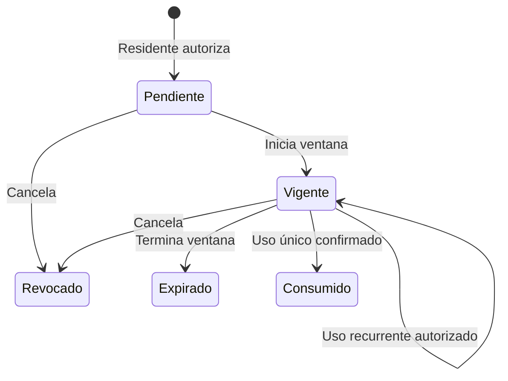

# AX-S — Fase 0: contrato, inventario y gate multi-MSP

**Fecha:** 2026-09-29  
**Base de código:** `main@997454ca65a7f5997240b0fe4b5c356d382fab87`  
**Estado:** inventario de código y despliegue completado; contraste con esquema PostgreSQL desplegado pendiente de identificación de proyecto/base/rol.  
**Naturaleza:** diagnóstico read-only y contrato, sin migración ni cambio de permisos.

Este documento ejecuta la fase 0 definida en [AXS_PLAN_MULTIMSP_MVNO_2026-09-29.md](AXS_PLAN_MULTIMSP_MVNO_2026-09-29.md). La ruta crítica siguiente es cerrar el gate de base y luego implementar la frontera MSP en un PR separado.

## 1. Fuente de verdad y alcance observado

- `backend/main.py` incluye `auth`, `canario`, `msp`, `visitas`, `qr`, `evidencias`, `preregistro`, `condominios`, `meta` y `webhooks`: **27 operaciones con decorador `@router`**, más rutas directas de `main.py` (`/`, `/health`, `/debug/db` fuera de producción, `/admin.html` si existe frontend estático).
- Railway: proyecto `pleasant-encouragement`, servicio `web`, fuente `B10sp4rt4n/MSP_AXS:main`, dominio `web-production-ed4f3.up.railway.app`. Último despliegue consultado: `SUCCESS` para el commit base, creado a las 16:38:37Z del 29-sep. El servicio declara `DATABASE_CORE_URL`, `DATABASE_EVENT_URL` y `DATABASE_GOV_URL`. Se revisaron **nombres**, no valores.
- `frontend-next` contiene las pantallas activas por rol y usa `/auth/me` y la API de Railway. `frontend` y `backend/static` también están en el árbol; no se verificó un despliegue vivo de esos frontends. Para el desarrollo nuevo, `frontend-next` es el candidato canónico, sujeto a comprobar qué URL usa el piloto.
- No se vinculó en esta revisión un proyecto Neon ni una base a ese servicio con evidencia directa. La presencia de nombres de variables en Railway **no prueba** qué esquema/rol está activo. No usar el proyecto Neon de RiskFlow para AX-S.

## 2. Matriz de rutas existente

Leyenda de hallazgos: **P** poder por rol global o control insuficiente de MSP; **T** falta alcance comprobado de condominio/recurso; **S** scope por condominio presente, pero no frontera MSP ni RLS probada; **M** operación exclusiva de plataforma que debe separarse del MSP; **F** flujo de acceso aún incompleto. La etiqueta señala revisión requerida; no afirma una explotación comprobada.

| Método y ruta | Actor actual / criterio observado | Recurso y origen del alcance | Hallazgo |
|---|---|---|---|
| `POST /auth/login` | Público; email/password, JWT y evento | Usuario de BD; condominio principal en evento | T: identidad aún usa `condominio_id` principal |
| `GET /auth/me` | Usuario autenticado | Devuelve rol y condominio principal | T: falta catálogo de membresías MSP/condominio |
| `GET /msps/` | `MSP_ADMIN` o `ADMIN` por rol | Consulta todos los MSP | P/M: diferenciar operador AX-S de admin MSP |
| `POST /msps/` | `MSP_ADMIN` o `ADMIN` por rol | Crea MSP | M: reserva a operador AX-S |
| `GET /condominios/` | MSP_ADMIN/ADMIN ve todos; otros usan scopes activos | Opcional `msp_id` proporcionado por cliente; lista casas/residentes | P: la vista MSP cruza proveedores |
| `POST /condominios/` | MSP_ADMIN/ADMIN por rol y GOV `crear_tenant` | `msp_id` del body; cuenta todos los condominios | P: puede seleccionar otro MSP; cuota no delimitada |
| `POST /condominios/{id}/casas` | Rol MSP_ADMIN/ADMIN/ADMIN_CONDOMINIO | `condominio_id` en path | P/T: no verifica membresía del actor |
| `POST /condominios/{id}/casas/{casa_id}/residente` | Mismos roles | Casa ligada al condominio del path | P/T: la relación recurso-tenant se comprueba; la del actor no |
| `GET /condominios/{id}/casas` | Rol MSP_ADMIN/ADMIN/ADMIN_CONDOMINIO/GUARDIA | `condominio_id` en path | P/T: no verifica membresía del actor |
| `POST /visitas/{condominio_id}` | Usuario con scope `ADMIN_CONDOMINIO`, contexto tenant, GOV y evento | Tenant del path | S: falta vínculo MSP; la pantalla de guardia invoca esta ruta, pero GUARDIA no cumple el nivel requerido |
| `POST /visitas/` | Legacy; validador de recurso/tenant, evento | `condominio_id` del body | S: sin contexto tenant consistente; mantener solo en transición |
| `GET /visitas/mis-visitas/{condominio_id}` | Scope `RESIDENTE`, contexto tenant | Tenant del path y `casa_unidad` del usuario | S: requiere validar membresía/unidad activa |
| `GET /visitas/condominio/{condominio_id}` | Scope `GUARDIA`, contexto tenant | Tenant del path | S: falta caseta/turno y prueba RLS |
| `PATCH /visitas/{visita_id}/salida` | Rol GUARDIA/MSP_ADMIN/ADMIN_CONDOMINIO | Visita por ID, sin alcance del actor al recurso | P/T: no comprueba tenant, MSP ni caseta |
| `PATCH /visitas/{visita_id}/cancelar` | Residente compara `condominio_id` y `casa_unidad`; admins por rol | Visita por ID | P/T: admin no se vincula al MSP/condominio; comparar unidad por texto es legado |
| `GET /visitas/{visita_id}` | Residente comprueba unidad; otros usuarios autenticados pasan | Visita por ID | P/T: lectura cruzada para otros roles |
| `POST /preregistro/crear` | Rol RESIDENTE/MSP_ADMIN/ADMIN_CONDOMINIO y GOV `generar_qr` | `usuario.condominio_id` y `casa_unidad` | T/F: falta unidad/membresía explícita, emite QR de visita |
| `GET /preregistro/qr/{visita_id}` | Mismos roles; compara condominio principal | Visita por ID | T/F: un residente del mismo condominio puede pedir QR de otra unidad; regeneración de imagen no coincide necesariamente con token guardado |
| `POST /qr/generar/{visita_id}` | Rol ADMIN_CONDOMINIO/RESIDENTE y GOV | Visita por ID | T/F: no verifica autor de la visita/unidad/MPS |
| `GET /qr/validar/{visita_id}/{token}` | Rol GUARDIA/MSP_ADMIN/ADMIN_CONDOMINIO | Visita y token en URL; cambia estado de entrada | P/T/F: no verifica guardia en tenant; GET muta; no acuse físico ni consumo atómico |
| `POST /evidencias/entrada/{visita_id}` | Rol GUARDIA | Visita por ID y archivos | T: no verifica guardia en condominio de visita |
| `POST /meta/assignments` | Usuario autenticado; servicio exige Authority GLOBAL | Identidad y tenant del body | M: autoridad de plataforma; no delegar como rol MSP |
| `DELETE /meta/assignments/{id}` | Authority GLOBAL vía servicio | Asignación por ID | M: autoridad de plataforma |
| `GET /meta/assignments` | Authority GLOBAL vía servicio | Filtro por identidad XOR tenant | M: listado global reservado al operador |
| `POST /qr/generar_gobernado` | Usuario autenticado; valida scope por tenant, GOV y evento | Tenant del body | S: canario demostrativo, no flujo de visita productivo |
| `GET /qr/canario/health` | Sin dependencia de usuario en handler | Ruta `/qr` protegida por `AUPSessionGuard`, pese a comentario de pública | F: reconciliar contrato/documentación y sesión CORE/GOV |
| `POST /webhooks/clerk` | Público por whitelist; verifica firma webhook en router | Alta/enlace de usuario; `DEFAULT_MSP_ID` | P/T: revisar asignación predeterminada y provisión explícita de membresía |

Notas: las rutas protegidas reciben `AUPSessionGuard`, pero eso autentica la **identidad**, no su derecho al MSP, condominio o puerta. `GET /preregistro/qr/{id}` y `GET /qr/validar/...` pueden escribir; requieren contrato de método y autorización por recurso. `/health` es salud de API, no prueba de aislamiento ni hardware.

## 3. Contrato de autorización de destino

| Actor | Alcance concedible | Operaciones permitidas en principio | Límite obligatorio |
|---|---|---|---|
| Operador AX-S | Plataforma | Alta/suspensión de MSP, soporte de plataforma, políticas globales y meta-operación | Poder global explícito y auditable; la operación normal no usa bypass |
| Administrador MSP | Membresía en uno o varios MSP específicos | Administrar condominios y personal de sus MSP, ver reportes agregados | Nunca listar ni crear recursos en otro MSP |
| Administrador condominio | Membresía en condominios específicos | Unidades, residentes, puertas y políticas autorizadas | No atraviesa condominio ni MSP padre |
| Guardia | Asignación a condominio/caseta/turno | Ver visitas autorizadas, validar pase, registrar entrada/salida y evidencia | Solo casetas asignadas, con vigencia |
| Residente | Membresía en unidad(es) y condominio | Autorizar/revocar sus pases y consultar sus visitas; acceso habitual | Unidad explícita, no comparación exclusiva por `casa_unidad` textual |
| Visitante | Pase limitado | Presentar QR/PIN emitido, consultar estado mínimo | Sin cuenta de residente, sin listados; puerta, ventana y usos limitados |
| Dispositivo | Identidad técnica por puerta/caseta | Enviar llamada/lectura/acuse, recibir órdenes autorizadas | No hereda rol humano; revocación y rotación propias |

La autorización debe resolver **actor → MSP → condominio → recurso** para cada ruta. El path/body selecciona un recurso, nunca concede derechos. Los roles de UI son navegación, no control de seguridad. GOV decide políticas de operación una vez comprobado el ámbito.

## 4. Estados y flujos base

Un intento de acceso tiene su propio estado: `recibido → denegado` o `recibido → autorizado → orden_enviada → apertura_confirmada`; `orden_enviada → fallo/timeout` exige conciliación. Un pase no se consume por el mero escaneo si la política exige apertura efectiva. La regla exacta de reintento y consumo debe fijarse en fase 2 según el controlador, sin prometer apertura cuando solo hubo autorización lógica.

1. **Visita prevista:** residente crea visita y pase vinculado a puerta/ventana/usos; comparte QR o PIN; lector o guardia presenta la credencial; backend comprueba vigencia, revocación, alcance, intentos y puerta; registra decisión; controlador confirma o el guardia registra manualmente resultado. No requiere activación en interfón.
2. **Imprevista:** dispositivo autenticado de la caseta crea solicitud ligada a puerta; residente de la unidad responde; autorización se consume en esa solicitud; acuse de puerta separado.
3. **Entrega:** residente crea PIN individual de un uso y horario; interfón/lector autenticado lo presenta; límite de intentos; consumo y resultado por puerta.
4. **Residente habitual:** credencial propia + membresía y política de puerta. Para acción privilegiada Plus, challenge WebAuthn/passkey fresco y ligado a actor, puerta y solicitud antes de ordenar apertura.

Faltan hoy modelos de `Puerta`, `Dispositivo`, `PaseAcceso`, `IntentoAcceso` y `AcuseApertura`. `Caseta` y `Visita` no sustituyen esas identidades.

## 5. Esquema y despliegue: contraste documental

| Capa | Evidencia de repositorio | Resultado |
|---|---|---|
| ORM CORE que importa el backend | `backend/db/core/models.py`: `msps_exo`, `condominios_exo`, `casas`, `usuarios`, `user_tenant_scope`, `casetas`, `visitas`, `evidencias` | Candidato de modelo operativo, no prueba de tabla desplegada |
| ORM EVENT/GOV | `backend/db/event/models.py`: `events_aup`; `backend/db/gov/models.py`: `authorities_gov`, `policies_gov`, `delegations_gov` | Sesiones separadas; eventos no forman una transacción ACID con CORE |
| ORM legado | `backend/db/models.py`: modelos duplicados y `identity_tenant_assignments`, importado por `meta` | Revisar la fuente real por módulo antes de migrar |
| SQL raíz | `database/schema_axs.sql`: SQLite `msps`, `usuarios`, `visitas` | No corresponde al ORM CORE actual |
| SQL Neon histórico | `database/NEON_SETUP_COMPLETE.sql`: `msps`, `condominios`, `user_tenant_scopes`, RLS para tablas con `tenant_id` y bypass declarado | No equivale a `msps_exo`, `condominios_exo`, `user_tenant_scope` actuales |
| RLS en app | `backend/core/tenant/context.py` intenta `SET app.tenant_id` y captura cualquier excepción | No hay prueba en Postgres de que el contexto se fije ni de que el rol no evada RLS |
| Prueba actual | `tests/smoke/test_tenant_isolation.py` usa SQLite en memoria y omite `current_setting` | Prueba scope de rutas; no demuestra políticas RLS |
| Railway | Servicio `web` del repo en `SUCCESS`; nombres de variables CORE/EVENT/GOV presentes | Código desplegado identificado; valores y esquema no verificados |

**Gate pendiente de solo lectura:** identificar el proyecto Neon/base/branch asociados a las tres variables del servicio sin publicar cadenas de conexión. Con el rol real de aplicación, consultar catálogo de tablas/columnas, políticas RLS, propietario y `FORCE ROW LEVEL SECURITY`, y comprobar si `set_config('app.tenant_id', ..., true)` en transacción aísla dos condominios. La consulta de metadatos no debe alterar datos de negocio. No usar una rama de RiskFlow ni ejecutar los SQL históricos como migración.

## 6. Escenarios de aceptación reproducibles

Fixture mínimo en base de prueba PostgreSQL: MSP A con condominios A1/A2; MSP B con B1/B2; operador AX-S, admin A, admin B, admin A1, guardia A1, residente de unidad A1-U1, residente de A1-U2, visitante con pase A1 y dispositivo de A1. Ningún ID se infiere por correo o rol.

| ID | Acción | Esperado |
|---|---|---|
| T01 | Admin A lista MSP/condominios | Ve A/A1/A2; nunca B/B1/B2 |
| T02 | Admin A crea casa o residente en B1 por path | 403/404 sin mutación ni filtración de datos |
| T03 | Guardia A1 pide visita por ID de B1 o A2 | 403/404; ninguna evidencia cruzada |
| T04 | Residente A1-U1 pide QR/visita de A1-U2 | 403/404; no recibe credencial |
| T05 | Admin A1 crea recurso en A1 y en B1 | Éxito solo en A1 |
| T06 | Operador AX-S crea MSP B con autoridad global explícita | Éxito auditable; no habilita automáticamente acciones del MSP A |
| T07 | Revocar membresía MSP o scope condominio y repetir T01/T05 | Corte inmediato |
| T08 | Dos requests simultáneas de pase único | A lo sumo una decisión consumible/orden idempotente |
| T09 | QR/PIN expirado, revocado o para otra puerta | Denegado; ningún acuse de apertura positiva |
| T10 | Dispositivo A1 informa un evento para B1 | Denegado con evento correlacionable |
| T11 | Controlador no responde tras autorización | Estado timeout visible; nunca `apertura_confirmada` |
| T12 | Reutilizar conexión de pool después de A1 para consulta B1 | Contexto aislado por transacción; no arrastra A1 |
| T13 | Usar rol real de app para consultar filas cruzadas sin tenant context | RLS deniega/filtra; test falla si el rol es propietario/bypass |
| T14 | UI manipula `localStorage.axs_condominio_id` a B1 | Backend rechaza; frontend no revela datos |
| T15 | Plus en puerta ordinaria y privilegiada | Challenge solo en privilegiada; prueba ligada a esa solicitud |

Para fase 1 son bloqueantes T01–T07 y T12–T14; T08–T11 corresponden a fases 2–3; T15 a Plus. Mantener la matriz entera como contrato de producto.

## 7. Resultado de fase 0 y siguiente PR

**Hecho:** inventario de 27 rutas, matriz actor/recurso, flujos, diferencias ORM/SQL, servicio Railway asociado y escenarios de aceptación.

**Pendiente verificable:** identificar con evidencia el proyecto/base/branch y rol PostgreSQL usados por CORE/EVENT/GOV, inspeccionar su esquema y políticas en solo lectura y registrar resultado de T12–T13 sobre una base de prueba. La fase 0 **no declara aislamiento productivo aprobado**.

**Primer PR de implementación (fase 1, después del contraste DB):**
1. Introducir membresía MSP explícita y autoridad de operador AX-S separada.
2. Migrar `/msps` y `/condominios` a autorización por MSP/recurso, sin rol global como pase.
3. Aplicar tenant context transaccional que falle en PostgreSQL si no se configura; validar rol/RLS en CI PostgreSQL.
4. Añadir T01–T07 y T12–T14 como gate, con migración reversible para esquema real.
5. Extender la autorización a visitas, preregistro, QR y evidencias antes de lanzar el producto a un segundo proveedor.

**Límite:** no se alteraron datos, permisos, infraestructura, dispositivos ni código funcional en esta fase 0.
